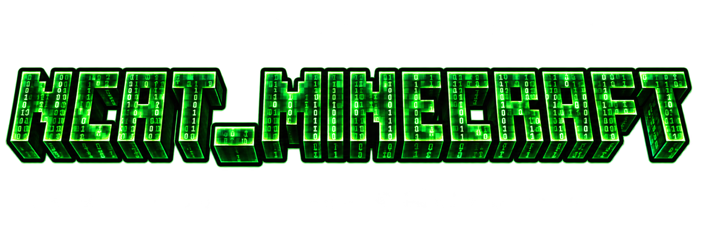

<p align="center">
  
</p>

<h1 align="center">NCAT Minecraft</h1>

<p align="center"><strong>A networking and cybersecurity lab inside Minecraft.</strong></p>

<p align="center">
  
  
  
  
  
</p>

<p align="center">🇧🇷 <a href="README.md">Português</a> · 🇺🇸 <strong>English</strong></p>

---
## Contents

- [What it is](#what-it-is)
- [Features](#features)
- [Requirements](#requirements)
- [Download and installation](#download-and-installation)
- [Getting started](#getting-started)
- [Keyboard shortcuts](#keyboard-shortcuts)
- [Creative tabs](#creative-tabs)
- [Recipes](#recipes)
- [Configuration](#configuration)
- [Building from source](#building-from-source)
- [Project layout](#project-layout)
- [Security and responsible use](#security-and-responsible-use)
- [Troubleshooting](#troubleshooting)
- [Contributing](#contributing)
- [Credits and licenses](#credits-and-licenses)

## What it is

**NCAT Minecraft** turns Minecraft into a networking and cybersecurity lab. In-game screens run a real Chromium browser. From them you can open SSH and SFTP sessions, a local terminal, remote desktop over RDP or VNC, and a proxy that pauses and edits HTTP requests in real time.

The network is physical too: data cables, RJ45 ports, VLAN-capable switches, racks full of modules and a workstation that reaches everything connected to it. The mod is built for classes and authorized labs, where students build the infrastructure by hand and watch the traffic flow.

## Features

### Screens

Each screen is a block that joins its neighbours into a larger monitor. The frame colour tells you what it does.

| Screen | Frame | What it does |
|---|---|---|
| **Browser** | red | Full Chromium with tabs, zoom, fullscreen, history and an address bar. |
| **SSH** | blue | A real SSH terminal (xterm.js) that verifies the server fingerprint. The password stays on your client. |
| **SFTP** | cyan | File explorer for the linked SSH session: browse, edit UTF-8 text up to 256 KiB, create, rename, delete and change permissions. |
| **Log** | orange | Records the HTTP and HTTPS requests of the linked browser. The laser inspector turns any of them into a detail tablet. |
| **Developer Tools** | purple | Elements (HTML), JavaScript console and network tab for the linked browser. |
| **Workstation** | light blue | Shows and controls any screen or rack module reachable over the data network. A footer switches between them. |
| **Terminal** | lime | A shell on your own computer: cmd, PowerShell, WSL distributions, bash, zsh. Runs on the client only. |
| **Remote Connection** | green | Remote desktop over RDP (FreeRDP) or VNC (noVNC). |
| **Proxy** | magenta | Intercepting proxy: watches traffic, pauses requests, lets you edit method, URL, headers and body, forward or drop, and keeps a history with response bodies. |

### Physical network

- **Data cable**, **RJ45 port** and **port installer**: any screen can get network ports. Cables hang with weight, route around blocks along the floor and take waypoints from the **cable adjuster**.
- 8-port **unmanaged switch** and 8-port **managed switch** with VLANs, disabled ports and port isolation. The managed switch is configured from the **configuration tablet**, wired to the switch console with the **serial cable**.
- **USB cable** and **USB port** to wire keyboards to screens.
- Activity LEDs on every port, blinking with real traffic.

### Rack

- **12U floor rack**, **18U extension** (stacks up to 6 sections) and **6U wall rack**.
- Modules: browser, SSH, SFTP, log, developer tools, terminal, remote connection, proxy, switch and managed switch.
- Glass door, per-module power, extra network ports and cables dressed through an inner side channel.
- Modules have no screen of their own: their content shows up on the workstation connected to the network.

### Tools and accessories

- **Linking tool**: ties a keyboard to a screen, or an analysis screen (log, developer tools, proxy, SFTP) to its source screen.
- **Screen configurator**: resolution, rotation, owner, friends and permissions.
- **Laser pointer**, **log laser inspector** and **request tablet**.

### Furniture

Gaming chair (you can sit on it), toilet, water cooler with jug and disposable cup, digital clocks (world time and local time), rubber duck and a Wi-Fi adapter.

## Requirements

| Item | Version |
|---|---|
| Minecraft Java Edition | 1.20.1 |
| Forge | 47.1.65 or newer, 47 series |
| Java | 17, 64-bit |
| MCEF | 2.1.1 for Forge 1.20.1 (required) |
| Operating system | Windows x64 or Linux x64 |

RDP only works on Windows x64 and Linux x64. The other screens depend on MCEF support for your platform. Every screen runs a Chromium instance, so give Minecraft at least 4 GB of memory.

## Download and installation

1. Install **Forge 1.20.1**, version 47.1.65 or newer, from the [official Forge site](https://files.minecraftforge.net/net/minecraftforge/forge/index_1.20.1.html).
2. Download **NCAT Minecraft** from the **[Releases](../../releases/latest)** page. Use `ncat_minecraft-<version>.jar`. If you see a file ending in `-slim.jar`, **do not use it**: it lacks the SSH and VNC libraries.
3. Download **MCEF 2.1.1** for Forge 1.20.1 from [Modrinth](https://modrinth.com/mod/mcef) or [CurseForge](https://www.curseforge.com/minecraft/mc-mods/mcef).
4. Put both files in the Minecraft `mods` folder:
   - Windows: `%APPDATA%\.minecraft\mods`
   - Linux: `~/.minecraft/mods`
5. Start the game with the Forge profile. On first launch MCEF downloads the Chromium binaries into `mods/mcef-libraries`, which can take a few minutes.

**Dedicated server:** install NCAT Minecraft and MCEF in the `mods` folder of the server **and** of every player.

**Verify the download:** each release ships a `SHA256SUMS.txt` file. Compare it with the hash of your file:

```bash
sha256sum ncat_minecraft-*.jar
```

```powershell
Get-FileHash .\ncat_minecraft-*.jar -Algorithm SHA256
```

## Getting started

### 1. Build a screen

Place screen blocks side by side to form a rectangle at least 2 blocks wide or tall (the default maximum is 16 × 16). Right-click any block with an empty hand: the screen turns on.

If a block is broken and placed back within 10 minutes, the screen comes back with the same settings and ports.

### 2. Type

- **Browser screens:** place a **browser keyboard** and tie it to the screen with the **linking tool**: click the screen first, then the keyboard. Click the keyboard to type. To change the address, crouch and right-click the screen.
- **Every other screen** (SSH, SFTP, log, developer tools, workstation, terminal, remote connection, proxy): crouch and right-click the screen to type straight away. Each screen's own keyboard works too.

### 3. Link analysis screens

The **log**, **developer tools** and **proxy** screens analyse a browser. The **SFTP** screen uses an SSH session. There are two ways to link them:

- **Linking tool:** click the source screen (browser or SSH), then the analysis screen.
- **Data cable:** connect both directly or through the switch network.

### 4. Build the network

1. With the **port installer** and **RJ45 ports** in your inventory, add ports to screens.
2. Hold a **data cable**, click a port on one device, then a port on another.
3. Use a **switch** to join several devices. On the **managed switch**, wire the **configuration tablet** over the **serial cable** to create VLANs, disable ports or isolate them.
4. Use the **cable adjuster** to add waypoints or take a cable back.

### 5. Use the workstation

Connect a **workstation screen** to the network. It lists every reachable screen and rack module, honouring VLANs and disabled ports. Pick a device in the footer to see and control its screen.

### 6. Build a rack

1. Place the **12U floor rack** on the ground and stack more sections on top (up to 6).
2. Holding a **module**, click the front of the rack. The height of the click picks the unit.
3. With an empty hand, click to open the panel: power modules on and off, remove them, open their ports and add network ports.
4. Crouch and click with an empty hand to open or close the glass door.
5. Run a data cable from the rack into the workstation network to see its modules.

### 7. Use the proxy

Link the **proxy** screen to a browser and pick a mode:

| Mode | Behaviour |
|---|---|
| **Observe** | Only records traffic. The browser loads normally. This is the default. |
| **Active** | The proxy sits in the request path and keeps the full request and response. |
| **Intercept** | Like active, but pauses each request so you can edit it and forward or drop it. |

A paused request is forwarded unchanged after 120 seconds so the page never hangs. The timeout can be changed in the configuration.

## Keyboard shortcuts

These apply to browser screens and to browser modules in a rack.

| Shortcut | Action |
|---|---|
| `Ctrl` + `L` | Edit the address |
| `F5` or `Ctrl` + `R` | Reload |
| `Alt` + `←` / `→` | Back / forward |
| `Alt` + `Home` | Home page |
| `Ctrl` + `T` / `Ctrl` + `W` | New tab / close tab |
| `Ctrl` + `Tab`, `Ctrl` + `1`…`8` | Switch tab |
| `Ctrl` + `+` / `-` / `0` | Zoom |
| `F11` | Fullscreen |
| `Esc` | Leave the keyboard |

## Creative tabs

NCAT Browser · NCAT SSH · NCAT Terminal · NCAT Proxy · NCAT Remote Connection · NCAT Cables · NCAT Network Equipment · NCAT Workstation · NCAT Rack and Modules · NCAT Furniture

## Recipes

Everything can be crafted in survival. Names follow the game language.

<details>
<summary><strong>Show every recipe</strong></summary>

**Screens**

| Item | Ingredients |
|---|---|
| NCAT Browser Screen | 4× iron ingot, 3× glass pane, 1× redstone, 1× red dye |
| NCAT SSH Screen | 4× iron ingot, 3× glass pane, 1× redstone, 1× blue dye |
| NCAT SFTP Screen | 4× iron ingot, 3× glass pane, 1× redstone, 1× cyan dye |
| NCAT Log Screen | 4× iron ingot, 3× glass pane, 1× redstone, 1× orange dye |
| NCAT Developer Tools Screen | 4× iron ingot, 3× glass pane, 1× redstone, 1× purple dye |
| NCAT Workstation Screen | 4× iron ingot, 3× glass pane, 1× NCAT Browser Screen, 1× redstone |
| NCAT Terminal Screen | 7× iron ingot, 1× glass pane, 1× redstone |
| NCAT Remote Connection Screen | 4× iron ingot, 3× glass pane, 1× redstone, 1× green dye |
| NCAT Proxy Screen | 7× iron ingot, 1× glass pane, 1× quartz |

**Keyboards**

| Item | Ingredients |
|---|---|
| NCAT Browser Keyboard | 3× iron ingot, 3× stone pressure plate, 2× red dye, 1× redstone |
| NCAT SSH Keyboard | 3× iron ingot, 3× stone pressure plate, 2× blue dye, 1× redstone |
| NCAT SFTP Keyboard | 3× iron ingot, 3× stone pressure plate, 2× cyan dye, 1× redstone |
| NCAT Developer Tools Keyboard | 3× iron ingot, 3× stone pressure plate, 2× purple dye, 1× redstone |
| NCAT Workstation Keyboard | 4× iron ingot, 2× stone pressure plate, 1× copper ingot, 1× NCAT Browser Keyboard, 1× redstone |
| NCAT Terminal Keyboard | 3× quartz, 2× iron ingot, 1× copper ingot |
| NCAT Proxy Keyboard | 3× quartz, 2× iron ingot, 1× amethyst shard |

**Network and cables**

| Item | Ingredients |
|---|---|
| NCAT Data Cable | 2× copper ingot, 2× string, 1× redstone |
| RJ45 Data Port | 2× iron nugget, 2× copper ingot, 1× redstone |
| Data Port Installer | 2× iron ingot, 1× redstone, 1× stick |
| Cable Adjuster | 4× iron ingot, 1× stick |
| NCAT USB Cable | 2× iron nugget, 2× string, 1× copper ingot |
| USB Port | 2× iron nugget, 1× copper ingot, 1× redstone |
| USB Port Installer | 2× iron ingot, 2× stick, 1× USB Port |
| USB Cable Adjuster | 2× iron ingot, 2× stick |
| NCAT Serial Cable | 2× copper ingot, 2× iron nugget, 1× redstone |
| NCAT Unmanaged Switch (8 Ports) | 8× RJ45 Data Port, 1× redstone comparator |
| NCAT Managed Switch (8 Ports) | 2× copper ingot, 1× redstone, 1× redstone comparator, 1× NCAT Unmanaged Switch (8 Ports) |
| NCAT Configuration Tablet | 4× iron ingot, 1× glass pane, 1× redstone, 1× smooth stone slab |

**Rack**

| Item | Ingredients |
|---|---|
| Rack Cabinet 12U | 6× iron ingot, 2× glass pane, 1× iron bars |
| Rack Extension 18U | 8× iron ingot, 1× Rack Cabinet 12U |
| Wall Rack 6U | 4× iron ingot, 1× glass pane, 1× iron bars |
| Rack browser | 7× iron ingot, 1× NCAT Browser Screen, 1× redstone |
| Rack SSH | 7× iron ingot, 1× NCAT SSH Screen, 1× redstone |
| Rack SFTP | 7× iron ingot, 1× NCAT SFTP Screen, 1× redstone |
| Rack log | 7× iron ingot, 1× NCAT Log Screen, 1× redstone |
| Rack developer tools | 7× iron ingot, 1× NCAT Developer Tools Screen, 1× redstone |
| Terminal for rack | 3× iron ingot, 2× glass pane, 1× redstone |
| Remote desktop for rack | 3× iron ingot, 2× glass pane, 1× ender pearl |
| Proxy for rack | 3× iron ingot, 2× glass pane, 1× quartz |
| Rack switch | 7× iron ingot, 1× NCAT Unmanaged Switch (8 Ports), 1× redstone |
| Rack managed switch | 7× iron ingot, 1× NCAT Managed Switch (8 Ports), 1× redstone |

**Tools**

| Item | Ingredients |
|---|---|
| Linking Tool | 1× redstone, 1× iron ingot, 1× stick |
| Screen Configurator | 2× iron ingot, 1× glass pane, 1× redstone, 1× stick |
| Laser Pointer | 1× glass pane, 1× redstone, 1× copper ingot |
| NCAT Log Laser Inspector | 2× iron ingot, 1× amethyst shard, 1× redstone |
| NCAT Request Tablet | 7× iron ingot, 1× glass pane, 1× redstone |

**Furniture**

| Item | Ingredients |
|---|---|
| NCAT Blue Cat Gaming Chair | 3× black wool, 2× blue wool, 2× iron ingot, 1× leather, 1× stone slab |
| NCAT Porcelain Toilet | 6× block of quartz, 1× iron ingot |
| NCAT Water Cooler | 5× iron ingot, 1× white concrete, 1× redstone, 1× cauldron, 1× lapis lazuli |
| Disposable Cup | 1× paper |
| Disposable Cup of Water | 1× Disposable Cup, 1× water bucket |
| Digital Clock (world time) | 5× black concrete, 2× redstone, 1× glass pane |
| Digital Clock (local time) | 5× white concrete, 2× redstone, 1× glass pane |
| Rubber Duck | 4× yellow dye, 1× slimeball |
| ALTA Wi-Fi Adapter | 3× iron ingot, 2× black concrete, 2× block of quartz, 1× redstone |

The **NCAT Water Jug** uses a special recipe: 8 glass blocks around a water bucket, filling the 3×3 grid. The jug comes out full.

</details>

## Configuration

The files live in the Minecraft `config` folder and are created on first launch.

### `ncat_minecraft_client.toml` (each player)

| Option | Default | Description |
|---|---|---|
| `terminal_enabled` | `true` | Lets the terminal screen start a shell on your computer. |
| `terminal_directory` | empty | Starting folder for the terminal. Empty uses your home folder. |
| `proxy_enabled` | `true` | Lets the proxy sit in the request path. When off, it only observes. |
| `proxy_hold_seconds` | `120` | How long (5 to 600 s) a paused request waits before going through unchanged. |
| `proxy_max_body_kib` | `1024` | Largest body (16 to 8192 KiB) the proxy keeps in memory. |
| `load_distance` | `30` | Distance, in blocks, at which screens start rendering. |
| `unload_distance` | `32` | Distance at which screens stop rendering. |
| `input.keyboard_camera` | `true` | Moves the camera toward the focused field while you type. |

### `ncat_minecraft_common.toml` (server and single player)

| Option | Default | Description |
|---|---|---|
| `browser_options.home_page` | `mod://ncat_minecraft/main.html` | Home page for browser screens. |
| `browser_options.blacklist` | empty | Domains blocked on every screen. |
| `screen_options.max_width` / `max_height` | `16` / `16` | Largest screen size, in blocks. |
| `screen_options.max_resolution_x` / `_y` | `1920` / `1080` | Largest screen resolution. |
| `mini_server.miniserv_port` | `25566` | TCP port of the file server inherited from WebDisplays. Set `0` to turn it off. |
| `mini_server.miniserv_quota` | `1024` | Per-player quota for that file server, in KiB. |

The file also contains options inherited from WebDisplays that do not affect NCAT features.

## Building from source

### Prerequisites

- **JDK 17**, for example [Eclipse Temurin](https://adoptium.net/temurin/releases/?version=17).
- **Git**.
- **Internet access on the first build**: Gradle downloads Forge, Minecraft and the mappings. Later builds can run offline.

### Build

```bash
git clone <url-of-this-repository>
cd ncat_minecraft
./gradlew build
```

On Windows, use `gradlew.bat build`.

The output lands in `build/libs/`:

| File | Use |
|---|---|
| `ncat_minecraft-<version>.jar` | **The complete mod.** This is the one for the `mods` folder. |
| `ncat_minecraft-<version>-slim.jar` | Without the bundled libraries (JSch and Netty). Not for playing. |

If Gradle cannot find Java 17 (a *toolchain* error), point `JAVA_HOME` at a JDK 17:

```bash
export JAVA_HOME=/path/to/jdk-17
./gradlew build
```

```powershell
$env:JAVA_HOME = "C:\path\to\jdk-17"
.\gradlew.bat build
```

After the first build, `./gradlew build --offline` compiles without network access.

### Run in development

```bash
./gradlew runClient
./gradlew runServer
```

Both tasks use the `run/` folder. To set up IntelliJ IDEA or Eclipse, import the project as Gradle and run `./gradlew genIntellijRuns` or `./gradlew genEclipseRuns`.

### Change the version

Update `mod_version` in `gradle.properties` **and** `version` in `src/main/resources/META-INF/mods.toml`.

### Regenerate models and textures

Models, textures, blockstates and icons are generated by scripts in `tools/`. They need **Python 3.10+** and **Pillow**. The previews also use **NumPy**.

```bash
pip install pillow numpy
python tools/gen_rack.py
python tools/create_rack_visuals.py
python tools/gen_switch.py
```

Run the scripts from the project root. `tools/strip_comments.py` strips comments from Java and Python code while keeping the license headers.

### RDP native libraries

The prebuilt packages live in `src/main/resources/assets/ncat_minecraft/native/rdp/` (`windows-x64.zip` and `linux-x64.zip`). To rebuild them:

- JNI bridge: `src/main/native/remote/` (CMake).
- Windows: `tools/package_windows_rdp.ps1`.
- Linux: `tools/package_linux_rdp.sh`.
- noVNC bundle: `node tools/build_novnc_bundle.mjs`.

## Project layout

```text
ncat_minecraft/
├── build.gradle, settings.gradle, gradle.properties   build
├── src/main/java/…/ncatminecraft/
│   ├── block/, entity/, item/, registry/              blocks, entities, items and registries
│   ├── client/
│   │   ├── proxy/, terminal/, ssh/, sftp/, remote/     services behind each screen
│   │   ├── rack/, workstation/, log/, devtools/        rack, workstation and analysis
│   │   ├── renderers/                                  rendering (cables, rack, switches)
│   │   └── gui/                                        user interfaces
│   ├── net/                                            network packets
│   └── utilities/                                      cables, screens, recovery
├── src/main/resources/
│   ├── assets/ncat_minecraft/html/                     screen pages
│   ├── assets/ncat_minecraft/lang/                     pt_br.json and en_us.json
│   └── data/ncat_minecraft/                            recipes and loot tables
├── src/main/native/remote/                             RDP JNI bridge
├── tools/                                              model generators and packaging
└── docs/                                               images and test guides
```

## Security and responsible use

- Use SSH, RDP, VNC, the terminal and the proxy **only on systems you own or are explicitly authorized to test**.
- The **terminal** opens a shell on the player's own computer, as that player's user, and never on the server. Turn it off with `terminal_enabled = false`.
- The **proxy** only affects browsers on the player's own client. Keep it observe-only with `proxy_enabled = false`.
- SSH and RDP passwords stay on the client and are never saved in the world.
- Screens are visible to any nearby player. Log, developer tools and proxy show request headers and bodies, which can contain cookies and tokens.
- The inherited file server opens TCP port `25566` when a world loads. If you do not use it, turn it off with `miniserv_port = 0`.
- Use `browser_options.blacklist` to block domains on every screen.

## Troubleshooting

| Symptom | What to do |
|---|---|
| The game will not start and reports a missing `mcef` | Install MCEF 2.1.1 for Forge 1.20.1 in the `mods` folder. |
| The screen stays black the first time | MCEF is still downloading Chromium. Wait and check the game log. |
| The screen will not turn on | Check that the rectangle is complete, with no missing blocks, and at least 2 blocks wide or tall. |
| SSH or SFTP fail with `NoClassDefFoundError` | You are using the `-slim.jar` file. Switch to the complete jar. |
| RDP is unavailable | RDP only exists on Windows x64 and Linux x64. VNC works without a native library. |
| The terminal does not list WSL | Run `wsl --list` on Windows to check that distributions are installed. |
| A page will not load through the proxy in active mode | Switch back to **Observe** and check the history. A redirect loop is cut off after 5 hops. |
| The build fails with a *toolchain* error | Point `JAVA_HOME` at a JDK 17. |

## Contributing

- Open an issue describing the problem or idea before a large pull request.
- Every player-facing string must exist in both `pt_br.json` **and** `en_us.json`. The HTML pages carry both languages in the file itself.
- The code base has no comments. Run `python tools/strip_comments.py` before submitting.
- Models and textures come from the scripts in `tools/`: change the script, not the generated JSON.
- Manual test guides (in Portuguese) live in [`docs/testes/`](docs/testes/).

## Credits and licenses

- Based on **[WebDisplays](https://github.com/CinemaMod/webdisplays)**, created by montoyo and maintained by CinemaMod Group, under the **MIT** license. See [LICENSE](LICENSE).
- **MCEF** (CinemaMod) is a separate dependency and is not redistributed here.
- Bundled libraries: **JSch 2.28.7** (Revised BSD and ISC), **Netty 4.1.82** (Apache 2.0), **xterm.js 5.5.0** and **addon-fit 0.10.0** (MIT), **noVNC 1.7.0** (MPL 2.0) and **FreeRDP 3.32.1** (Apache 2.0).
- Full details, versions and notices in [NOTICE.md](NOTICE.md).

Minecraft is a trademark of Mojang Studios. This is an unofficial project with no affiliation with Mojang or Microsoft.
